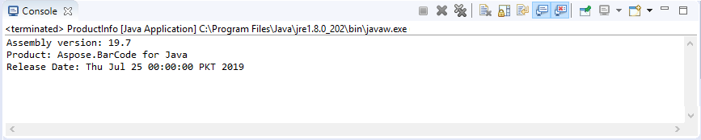

{} 

Aspose.BarCode for Java provides static fields in the BuildVersionInfo class for getting information about product name, assembly version, release date etc.

{} 

Below is a code snippet that prints the product and assembly info on the output screen.



||
| :- |
|**Figure: Output screen**|

