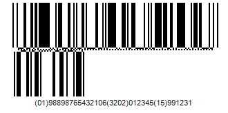

{} 

Aspose.BarCode supports to generate Databar Expanded Stacked coded barcode with segments per row settings

{} 
### **How to Generate Barcode With Segments Per Row**
Aspose.BarCode for Java supports to set segments per row while generating the barcode. A property BarcodeGenerator.getParameters().getBarcode().getDataBar().setColumns() is exposed to serve the purpose. Following is the sample code demonstrating how to set segments per row before generating a barcode image.



||
| :- |
|**Figure: Output barcode**|

