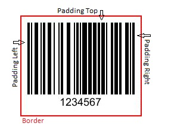
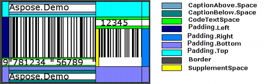

{} 

This article demonstrates how [Aspose.BarCode](https://apireference.aspose.com/java/barcode) allows developers to handle image padding area.

{} 

The padding is the area between the border and the area captured by barcode bars and code text. Developers can set the padding by calling the getPadding() method provided under [BaseGenerationParameters ](https://apireference.aspose.com/java/barcode/com.aspose.barcode.generation/BaseGenerationParameters)class of BarcodeGenerator class. The getPadding() method takes an instance of the [Padding ](https://apireference.aspose.com/java/barcode/com.aspose.barcode.generation/Padding)class that provides the getLeft(), getRight(), getTop() and getBottom() methods used to set padding by further calling setPixels() method.

All concepts about border margins can be visualised from the figure below:

||
| :- |
|**Figure: Graphical demonstration padding**|

The following code snippet shows you how to set the padding for barcode image.
#### **Java**

### **Combining Various Settings**
The following picture explains how various settings work together.

||
| :- |
|**Figure: Barcode**|

||
| :- |
|**Figure: Graphical demonstration of image margins**|

