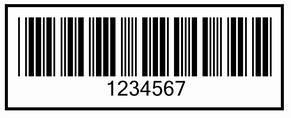

{} 

This article demonstrates how [Aspose.BarCode](https://apireference.aspose.com/java/barcode) allows developers to handle image borders.

{} 
### **Border Width**
A very simple but handy feature is to set the border width of the barcode image. The border can be made thick or thin by setPixels() method and calling with the getParameters().getBorder().getWidth() method of the [BarcodeGenerator](https://apireference.aspose.com/java/barcode/com.aspose.barcode.generation/BarcodeGenerator) class.
#### **Java**

### **Enable Image Border**
Developers may also decide whether to show or hide an image border by passing true to the setBorderVisible() method of the BarcodeGenerator class.
#### **Java**


A complete example that handles barcode image borders is given below. The output barcode is shown below.

**Output barcode** 

#### **Java**

