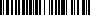

{} 

Originally, barcodes systematically represented data by varying the widths and spacings of parallel lines. Now, you can generate and recognize barcodes with custom widths. The idea is to calculate the widths for all supported properties and generate a barcode that fits in the space that is left.

Barcodes with custom widths support these properties:

- The caption above and below but not to the left, center or right.
- CodeText (only at the bottom).
- Margins.
- Different graphics unit as usual.
- Limited to two lines for each type of text. More will flatten the barcode image.
- If no license has been applied, that is, if you're [evaluating Aspose.BarCode](/barcode/java/licensing-html/#licensing-limitations), an evaluation watermark appears at the top left corner.
- To get a barcode image with no text or margins, turn off those properties.

{} 

Below are code snippets that create custom width bar code.
#### **Create an Image With Exact Barcode Only**
#### **Java**


**Sample image** 

Below are code snippets that create custom width barcode.
#### **Create and Set Size for the Whole Picture With Barcode**
#### **Java**


||
| :- |
|**Figure: Sample image**|

