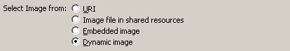

{} 

This tutorial shows how to print barcode images on BIRT reports. It uses Eclipse's BIRT Report Designer plug-in to design the report visually and then uses the BIRT runtime SDK to modify the report dynamically and insert barcode images. Finally, the report is exported to PDF.

The following tools are needed in order to complete this tutorial:

1. Eclipse SDK
1. BIRT Report Designer plug-in (along with required dependencies)
1. BIRT Runtime (can be downloaded from <http://download.eclipse.org/birt/downloads/>)
1. JDK 1.5 or higher
1. Aspose.BarCode for Java

{} 
### **Designing the Report**
The first step is to design the report that the barcodes will be displayed in. When the report is prepared, [write the code](/barcode/java/how-to-print-barcode-images-on-birt-reports-html/) that adds the barcodes dynamically.
#### **Create New Project**
To design the report:

1. Open Eclipse, if it’s not opened already.
1. From the **File** menu, choose **New** and then **Project**.
1. Open the **Business Intelligence and Reporting Tools** node and select Report Project as shown below:

||
| :- |
1. Give the project a name and finish the New Project Wizard.
##### **Add New Report to the Project**
To add a report to the project:

1. Open the Navigator, right-click on the Report Project created above.
1. From the menu, select **New** and then **Report**.
1. Call the report **customers.rptdesign**.
1. Click **Next**.
1. From the report templates, select “My First Report” and click on **Finish** to exit the report wizard.

||
| :- |
##### **Add New Data Source**
The new report is displayed in the layout view. It has four columns but no data.

1. In Eclipse, open the Data Explorer.
1. Right-click the Data Sources node and select **New Data Source** from the menu.
1. Choose **Classic Models Inc. Sample Database** from the data source list.
1. Click **Next** and then **Finish** to exit the data source wizard.
##### **Add New Data Set**
To add a data set:

1. Click the **Data Sets** node in the Data Explorer and select **New Data Set**.
1. Select the new Data Source from the list.
1. In **Data Set Type**, choose **SQL Select Query**.
1. Click **Next**.
1. In the SQL window, type in the query Select * From CLASSICMODELS.CUSTOMERS as shown in the figure below:

||
| :- |
1. Click **Finish** to exit the wizard.
   The Edit Data Set screen opens.
1. Click **Preview Results** to verify that the data connection is OK and you can see some data on the screen.

||
| :- |
##### **Preview Report**
1. Open the Data Explorer window.
1. Open the new data set.
   You should see the fields from the **Customers** table.
1. Drag the fields onto the report as shown below.

||
| :- |
1. Click the **Preview** tab.
   You should see a list of customers on the report.
##### **Add New Column for Barcode**
Add a new column to the report, where the barcode images will be displayed:

1. In layout view, right-click the table header of the **Phone** column and choose **Insert** followed by **Column to the Right**.
1. Insert a new label in the column header and set its value to **Barcode**.
##### **Add Image**
1. In the detail row, barcode column, add a new image from the Palette window. The Edit Image Item screen opens.
1. Select **Dynamic Image** from the list.

||
| :- |
1. Click **Select Image Data**.
1. click **Add** on the right.
1. Type **imgBarCode** in the **Column Binding Name** field.
1. Set **Display Name** to **Barcode**.
1. For the **Data Type**, select **Blob** from the list.

||
| :- |
1. Click **Expression** and enter the following code in the text area: reportContext.getAppContext().get("imgBarCode");

||
| :- |
1. Click **OK**.
1. In the Select Data Binding window, select **imgBarCode** to enable it.
1. Click **OK**.
   row["imgBarCode"] is inserted in the dynamic expression textbox.

||
| :- |
1. Click **Insert** to add the image to the report.
   Now preview the report in Eclipse. Image placeholders are shown in the report preview.

||
| :- |
1. Save the report.

That completes the report design.
### **Insert BarCode Images Dynamically in the BIRT Report**
Use the BIRT runtime engine and Aspose.BarCode for Java to generate the barcode images and insert into the newly created report.
#### **Create a New .Java File**
1. Create a new Java project in Eclipse.
1. Create a new Java file.
1. Add the following code to the Java program file.
   You need to make sure that you refer to the relevant .jar files of Aspose.BarCode for Java and BIRT runtime, to make the program compile successfully.

**Java**



 import java.awt.Image;

import java.awt.image.RenderedImage;

import java.io.ByteArrayOutputStream;

import java.util.logging.Level;

import javax.imageio.ImageIO;

import org.eclipse.birt.core.framework.Platform;

import org.eclipse.birt.report.engine.api.EngineConfig;

import org.eclipse.birt.report.engine.api.HTMLRenderOption;

import org.eclipse.birt.report.engine.api.IReportEngine;

import org.eclipse.birt.report.engine.api.IReportEngineFactory;

import org.eclipse.birt.report.engine.api.IReportRunnable;

import org.eclipse.birt.report.engine.api.IRunAndRenderTask;

import org.eclipse.birt.report.engine.api.PDFRenderOption;

import com.aspose.barcode.BarCodeBuilder;

import com.aspose.barcode.Symbology;

IReportEngine engine = null;

try{

	System.out.println("engine configuration......");

	EngineConfig config = new EngineConfig( );

	config.setEngineHome( "C:\\birt-runtime-2_5_0\\ReportEngine" );

	//config.setLogConfig("C:\\birt-runtime-2_5_0\\ReportEngine\\temp", Level.INFO);

	System.out.println("startup platform......");

	Platform.startup( config );

	IReportEngineFactory factory = (IReportEngineFactory) Platform.createFactoryObject( IReportEngineFactory.EXTENSION_REPORT_ENGINE_FACTORY );

	engine = factory.createReportEngine( config );

	//engine.changeLogLevel( Level.WARNING );

	// Run reports, etc.

	System.out.println("Open the report......");

	IReportRunnable design = null;

        // Open the report design

        design = engine.openReportDesign("C:\\customers.rptdesign");

        IRunAndRenderTask task = engine.createRunAndRenderTask(design);

        System.out.println("generate PDF report......");

        PDFRenderOption options = new PDFRenderOption();

        options.setOutputFileName("C:\\test.pdf");

        options.setOutputFormat("pdf");

        System.out.println("place barcode......");

        BarCodeBuilder builder = new BarCodeBuilder();

        builder.setSymbologyType(Symbology.Datamatrix);

        builder.setCodeTextVisible(false);

        builder.setCodeText("test-123");

        Image img = builder.generateBarCodeImage();

        ByteArrayOutputStream out = new ByteArrayOutputStream();

        ImageIO.write((RenderedImage)img, "png", out);

        byte[] bytes = out.toByteArray();

        task.getAppContext().put("imgBarCode", bytes);

        System.out.println("close the task......");

        task.setRenderOption(options);

        task.run();

        task.close();

}catch( Exception ex){

	ex.printStackTrace();

}

finally

{

	engine.destroy();

	Platform.shutdown();

	System.out.println("engine destroyed......");

}


#### **Output**
The PDF report is generated on the specified location after the program is compiled and run successfully.

A screenshot of the PDF report is shown below.
**Output report, with barcode**

||
| :- |

