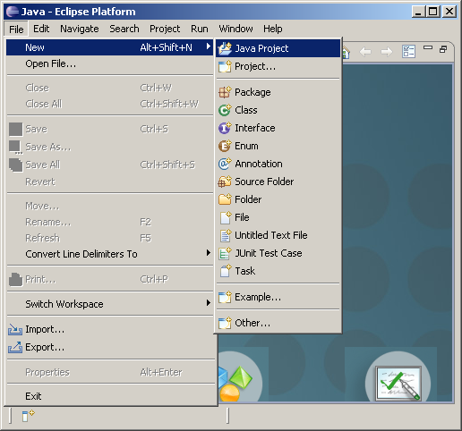
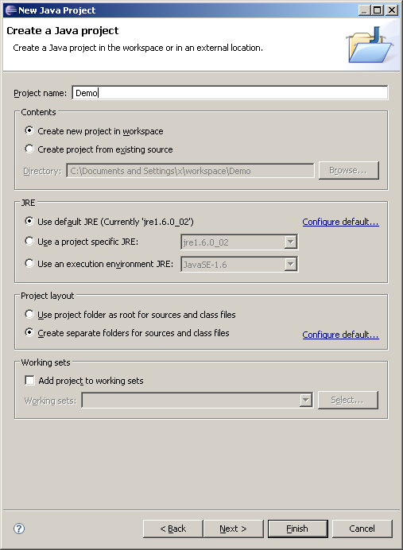
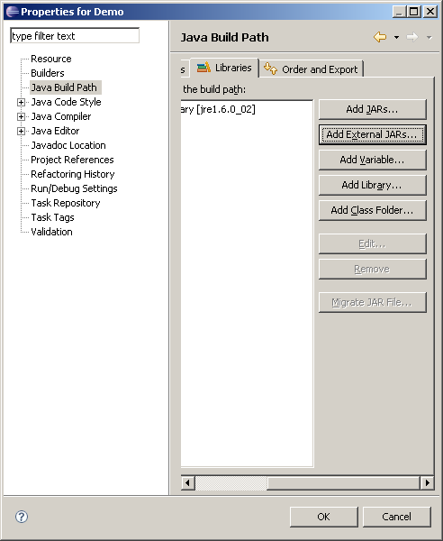
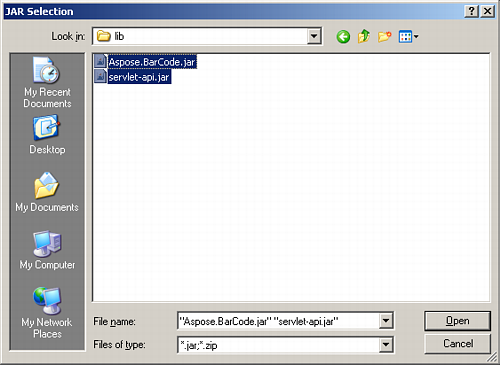
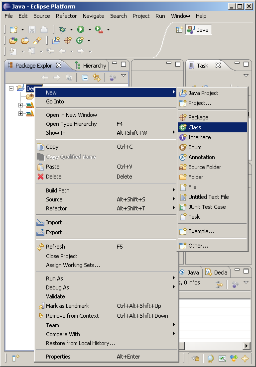
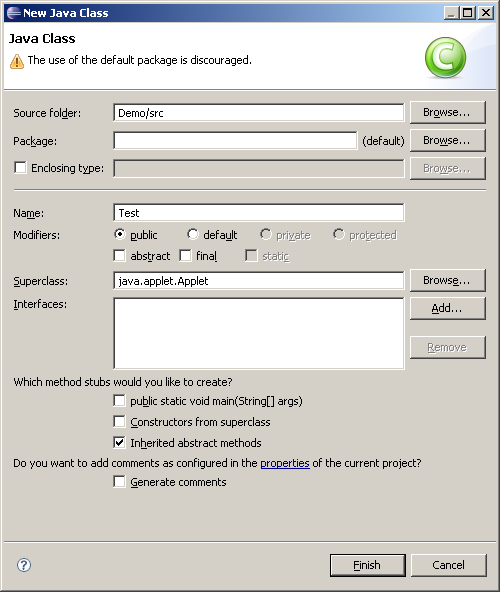
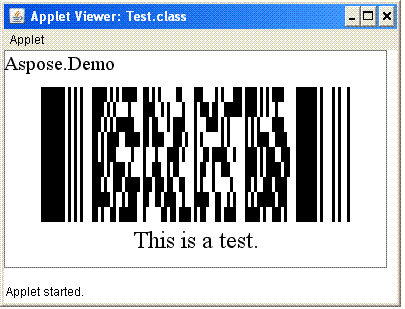

{} 

Aspose.BarCode for Java provides features for generating and recognising more than 20 types of barcode.

This tutorial demonstrates how to use Aspose.BarCode for Java to generate a Pdf417 barcode image, and then read the barcode in that image.

For this tutorial, we used Eclipse as the IDE, which is free and could be downloaded at:
<http://www.eclipse.org/downloads/>

{} 
### **Barcode Generation**
1. Start Eclipse and create a new Java project.

   **Creating a new Java project** 

1. Call the project Demo and click **Finish**.
   We will configure the library later.

   **Naming the project** 

1. Right-click the project we just created and choose properties.

   **Setting project properties** 

1. Click on the **Java Build Path** item and choose the Libraries tab.
1. Click **Add external Jars**.
1. In the open file dialog, locate Aspose.BarCode.jar and Servlet-api.jar. They are available at the lib directory of the download package of Aspose.BarCode for Java.

   **Adding references** 

{} 

You could use your own Servlet-api.jar if available.

{}

1. Right-click the Demo project and choose **New**, and then **Class** on Package Explorer.

   **Creating a new class** 

1. Let this new class be an Applet and name it Test.

   **Setting properties for the new class** 

1. Write the code that generates a Pdf417 barcode:



1. Right-click this class in the package explorer and select **Run As** and **Java Applet**.

   **The generated barcode image** 

1. Save the image to file. Continuing the sample above, add this code to save the barcode image to file:


### **Barcode Recognition**
Continuing the sample above, we can add code to scan a barcode from an image:



The evaluation version of Aspose.BarCode for Java only allows Code39 types of barcodes. To test the speed and accuracy of other barcode symbologies, please use the demo JAR provided in the download package.

{} 

If instantiating the BarCodeReader throws an exception, it’s probably because the image format is not supported. Download the free JAI library to load the image from [www.java.net](http://www.java.net).

{}
