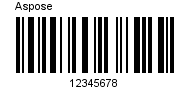

{} 

You can download an evaluation version of **Aspose.BarCode** for Java from its [download page](http://maven.aspose.com/repository/simple/ext-release-local/com/aspose/aspose-barcode/). The evaluation version provides absolutely the same capabilities as the licensed version of the product. Furthermore, the evaluation version simply becomes licensed when you purchase a license and add a couple of lines of code to apply for the license.

Once you are happy with your evaluation of **Aspose.BarCode**, you can [purchase a license](https://purchase.aspose.com/default.aspx) at the Aspose website. Make yourself familiar with the different subscription types offered. If you have any questions, do not hesitate to contact the Aspose sales team.

Every Aspose license carries a one-year subscription for free upgrades to any new versions or fixes that come out during this time. Technical support is free and unlimited and provided both to licensed and evaluation users.

{} 

If you want to test **Aspose.BarCode** without evaluation version limitations requests a 30-day temporary license. Please refer to [How to get a Temporary License?](https://purchase.aspose.com/temporary-license) for more information.
### **The Evaluation Version Limitation**
The evaluation version of **Aspose.BarCode** (without a license specified) provides full barcode generation functionality, but it shows an evaluation watermark on the barcode image.

||
| :- |
The evaluation version of Aspose.BarCode's recognition library only supports Code39 barcode recognition. However, a full-featured demo application is provided for all supported barcode symbologies.
### **Setting a License**
The license is a plain text XML file that contains details such as the product name, number of developers it is licensed to, subscription expiry date and so on. The file is digitally signed, so do not modify the file; even the inadvertent addition of an extra line break into the file will invalidate it.

You need to set a license before utilizing **Aspose.BarCode** if you want to avoid its evaluation limitation. You are only required to set a license once per application or process.

The license can be loaded from a stream or file in the following locations:

1. Explicit path.
1. The folder that contains the Aspose.BarCode.jar.

Use the [License](http://www.aspose.com/api/java/barcode/com.aspose.barcode/classes/License).setLicense method to license the component. Often the easiest way to set a license is to put the license file in the same folder as Aspose.BarCode.jar and specify just the file name without a path as shown in the following example:
#### **Example 1**
In this example Aspose.BarCode will attempt to find the license file in the folder that contains the JARs of your application.



#### **Example**
Initializes a the license from a stream.



### **Applying Metered Key**
Aspose.BarCode for Java allows developers to apply metered key. It is a new licensing mechanism. The new licensing mechanism will be used along with the existing licensing method. Those customers who want to be billed based on the usage of the API features can use the metered licensing. For more details, please refer to [the Metered Licensing FAQ](https://purchase.aspose.com/faqs/licensing/metered) section.

**Metered** class has been introduced to apply metered key. Following is the sample code demonstrating how to set metered public and private key.



