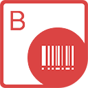

{} 

**Welcome to Aspose.BarCode for Java**

Aspose.BarCode for Java is a robust and reliable barcode generation and recognition component, written in Java, it allows developers to quickly and easily add barcode generation and recognition functionality to their Java applications. It is available for the Java SE, Java EE and Java ME platforms.

Aspose.BarCode for Java supports most established barcode standards and barcode specifications. It has the ability to export to multiple image formats including: BMP, GIF, JPEG, PNG and TIFF.

This section introduces Aspose.BarCode for Java and its features, gives examples as case studies and lists some customers who choose to use Aspose.BarCode in their solutions. This section also includes information about Aspose.BarCode for Java [installation](/barcode/java/installation-html/), [evaluation](/barcode/java/installation-html/) and [licensing](/barcode/java/licensing-html/).

{} 
### **Product Description**
Aspose.BarCode for Java provides fully featured demos and working examples written in Java for developers to have a better understanding of our product. Using these demos, developers can quickly learn about the features provided by Aspose.BarCode.

There is no printer limitation for the barcodes generated with Aspose.BarCode. Developers can use any kind of printer to print barcodes but naturally, the quality of the printed barcode images will be affected by the printers with low resolution.
#### **General Barcode Features**
- Specify different kinds of symbologies.
- Barcode Code text (data to be encoded to barcode image) can be set and its appearance related properties like font, back color, fore color, alignment and location (hide, above, below) etc. can also be modified.
- Barcode Caption and its font, back color, fore color, alignment and location (hide, above, below) can be managed.
- Checksum and Supplement Data are supported.
- Bar height of the barcode images can be customized.
- X-dimension, Y-dimension (for 2D BarCodes) are also supported.
- Code128 encoding is exceptionally optimized.
- Wide to Narrow Ratio can be achieved for supported symbologies.
#### **Barcode Recognition Features**
- Aspose.BarCode.BarCodeReader reads most common 1D, 2D barcodes anywhere at any angle from an image.
#### **Barcode Imaging Features**
- Manipulate barcode image borders, border color, style, margins & width etc.
- Barcode image color, back color and bar color can be modified.
- Rotate barcode images to any degrees.
- High Quality barcode images.
- Anti-Aliasing for barcode images.
- Barcode Image MarginsF can be managed.
- Customized Resolution.
- Size in inches and millimeters.
- Auto Sizing of barcode images.
- Create barcode images to image formats like JPEG, TIFF, PNG, TIFF, WMF, metafile etc.
- Render barcode images on any device and create device resolution dependent images.
### **Input Image Formats**
- JPEG
- TIFF
- PNG
- BMP
- GIF
- EXIF
### **Output Image Formats**
- JPEG
- TIFF
- PNG
- BMP
- GIF
- EXIF
- EMF
- SVG
#### **Utility Features**
- Print barcode images.
#### **Platforms Supported**
- Java Standard Edition 1.4 or greater.
- Java Enterprise Edition.
- Java Mobile Edition 3.0.
#### **Supported Barcode Symbologies**
##### **Numeric Only Symbologies**
- EAN13
- EAN8
- UPCA
- UPCE
- BooklandEAN
- Interleaved2of5
- Standard2of5
- MSI
- Code11
- Codabar
- Postnet
- Planet
- EAN14(SCC14)
- SSCC18
- ITF14
- Leticode
- OPC
##### **Alpha-Numeric Symbologies**
- Code128
- EAN128
- Code39 Extended
- Code39 Standard
- Code93 Extended
- Code93 Standard
- Australia Post
- Matrix 2 of 5
- PZN
- Deutsche Post Identcode
- VIN
##### **2D Symbologies**
- Pdf417
- DataMatrix
- Aztec
- QR
- Swiss QR (QR Bill)

Aspose.BarCode for Java provides encoding and decoding features for all above mentioned symbologies, with exception of Australia Post and Aztec. At the moment we only support encoding for these two symbols.
