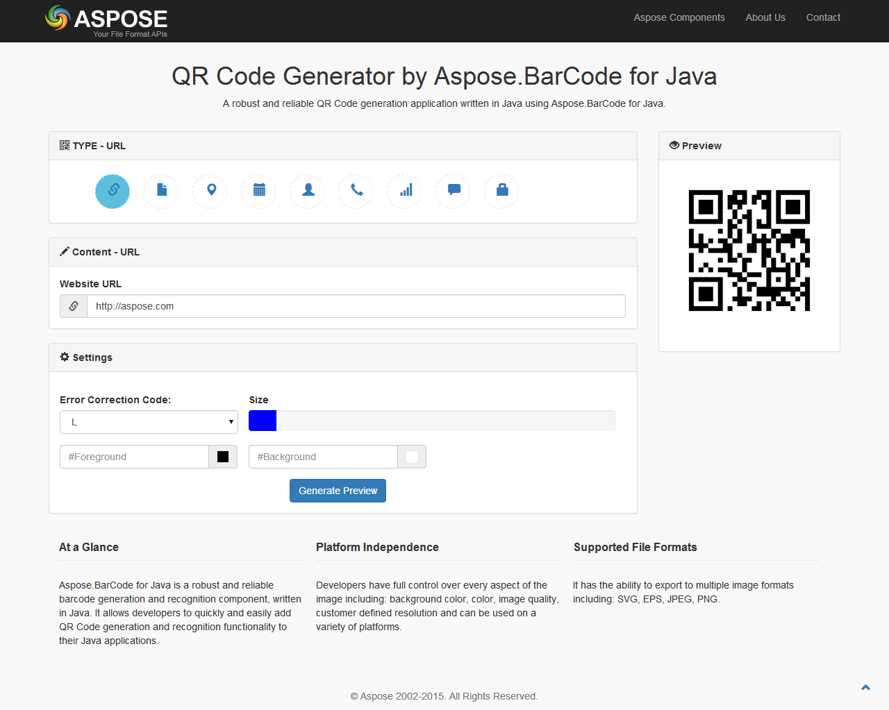

## **What is QR Code Generator by Aspose.BarCode for Java?**
**QR Code Generator by Aspose.BarCode for Java** is an [open source](https://github.com/AsposeShowcase/QR_Code_Generator_by_Aspose.BarCode_for_Java) web application to generate various types of QR Codes using [Aspose.BarCode for Java](http://www.aspose.com/java/barcode-component.aspx). Its Restful API architecture not only allows generating QR Codes but also embedding them into any websites using the  tag. 

The mobile-friendly and fully responsive UI of **QR Code Generator by Aspose.BarCode for Java** is developed using jQuery Ajax, Bootstrap, RequireJS, Backbone.js and is powered by [Aspose.BarCode for Java](http://www.aspose.com/java/barcode-component.aspx) at the Back-end.

||
| :- |
## **Features**
Currently, it supports the following features:

- Generate following types of (scan-able) QR Codes: 
  - Text
  - Contact (VCard)
  - SMS
  - Phone
  - Event
  - Wifi Password
  - Geo Location
- Generate encrypted QR Code for some text.
- Supports following customizations on generated QR Code: 
  - Resizing or Scaling.
  - Selection of Level of Reed-Solomon error correction.
  - Foreground and Background Color Selection.
- Save the generated QR Code in different image formats (BMP, GIF, JPEG, PNG, TIFF).
- Generate encrypted QR Code from Plain Text using password-based encryption (PBE)- PBEWITHMD5AND128BITAES-CBC-OPENSSL with OpenSSL compatibility.
