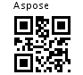

## **Level of Reed Solomon error correction selection**
QR Code has error correction capability to restore data if the code is dirty or damaged. There are 4 error correction levels used for QR codes, with each one adding different amounts of “backup” data depending on how much damage the QR code is expected to suffer in its intended environment, and hence how much error correction may be required:

- Level L – up to 7% damage
- Level M – up to 15% damage
- Level Q – up to 25% damage
- Level H – up to 30% damage

[Aspose.BarCode for Java](http://www.aspose.com/java/barcode-component.aspx) library is supporting four error correction levels for users to choose according to the operating environment. Raising this level improves error correction capability but also increases the amount of data QR Code size.

To generate a QR Code with customize Level of Reed solomon error correction selection, please refer to the following steps:

1. Select the Type
1. Input the QR Code content data
1. Select Level of Reed Solomon error correction from error correct dropdown list under settings section
1. Click **Generate Preview** button

That's It. You will see the generated QR Code with selected Level of Reed Solomon error correction in image under preview section.

**How it works?**
#### **API**


 GET /qrcodegen/api/qrcode/generate?data=<DATA>&foreColor=&bgColor=&ecc=[L|M|H|Q]&size=&format=

Example:

http://localhost:8080/qrcodegen/api/qrcode/generate?data=http://aspose.com&foreColor=&bgColor=&ecc=L&size=&format=



**Generated QR Code**

#### **Java Script**
***addRequestSettings*** function is used to add customize QR Code settings options in the API request parameters. Here is the code spinet. 



  addRequestSettings : function(requestString){

 requestString = requestString + "&ecc=" + this.$('.errorCorrectionCode option:selected').text();

 requestString = requestString + "&foreColor=" + encodeURIComponent(this.$('.input-fcolor').val());

 requestString = requestString + "&bgColor=" + encodeURIComponent(this.$('.input-bgcolor').val());

 if(this.$('.input-size').val() != "100x100")

 requestString = requestString + "&size=" + this.$('.input-size').val();

 return requestString;

 }


#### **Java**
**Core API Method - QRCodeManagementController.generateQRCode** 



 @RequestMapping(value = "generate", method = RequestMethod.GET,

    		produces = {MediaType.IMAGE_JPEG_VALUE, MediaType.IMAGE_PNG_VALUE, MediaType.IMAGE_GIF_VALUE, MediaType_IMAGE_TIFF_VALUE, MediaType_IMAGE_BMP_VALUE})

    @ApiOperation(value = "Generate QR Code.")

    public ResponseEntity<byte[]>  generateQRCode(

    		@ApiParam( value = "data", name="data" , required = true)

    		@RequestParam("data") String data,

        HttpServletRequest request,HttpServletResponse response,

        @ApiParam( value = "A user-chosen password that can be used with password-based encryption (PBE) Algo PBEWITHMD5AND128BITAES-CBC-OPENSSL)", name="passKey", required=false) @RequestParam(required=false, value="passKey") String passKey,

        @ApiParam( value = "ForeColor e.g #000000 (Black - RGB(hex))", name="foreColor", required=false) @RequestParam(required=false, value="foreColor") String foreColor,

        @ApiParam( value = "BackgroundColor e.g #FFFFFF (White - RGB(hex))", name="bgColor", required=false) @RequestParam(required=false, value="bgColor") String bgColor,

        @ApiParam( value = "L|M|Q|H - Reed-Solomon error correctionCode Level(from low to high) default=Low", name="ecc", required=false) @RequestParam(required=false, value="ecc") String ecc,

        @ApiParam( value = "Image Size e.g #150x150", name="size", required=false) @RequestParam(required=false, value="size") String size,

        @ApiParam( value = "jpeg|tiff|gif|png|bmp - default=png", name="format", required=false) @RequestParam(required=false, value="format") String format,

        @ApiParam( value = "true|false default=false", name="download", required=false) @RequestParam(required=false, value="download") boolean download,

        @ApiIgnore @Value("#{request.getHeader('" +  ACCEPT_HEADER + "')}") String acceptHeaderValue) throws Exception {



**Level of Reed Solomon error correction Code Spinet** - **QRCodeManagementController.generateQRCode**



 builder.setQRErrorLevel(getErrorCorrectCode(ecc, QRErrorLevel.LevelL));

 private int getErrorCorrectCode(String ecc, int defaultLlevel) {

 if(StringUtils.isBlank(ecc))

 return defaultLlevel;

 ecc = ecc.trim();

 if("L".equalsIgnoreCase(ecc))

 return QRErrorLevel.LevelL;

 else if("M".equalsIgnoreCase(ecc))

 return QRErrorLevel.LevelM;

 else if("Q".equalsIgnoreCase(ecc))

 return QRErrorLevel.LevelQ;

 else if("H".equalsIgnoreCase(ecc))

 return QRErrorLevel.LevelH;

 return QRErrorLevel.LevelL;

 }


