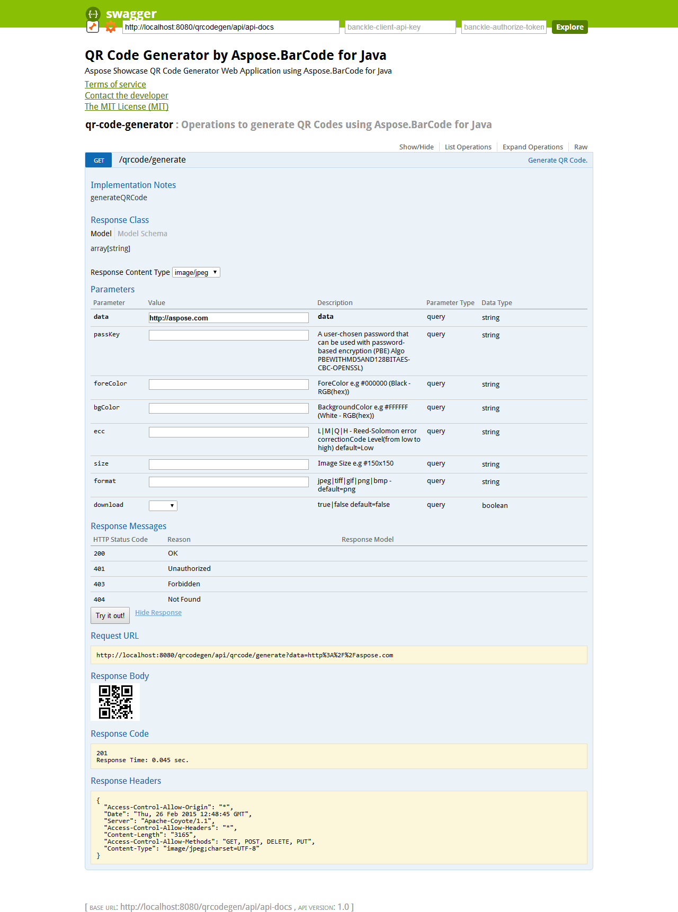

Application also exports its Restful APIs documentation by using swagger specification. You can view the application APIs swagger based documentation by accessing following URL after running the project. [**http://localhost:8080/qrcodegen/public/docs/**](http://localhost:8080/qrcodegen/public/docs/)

-----

|

|
| :- |

